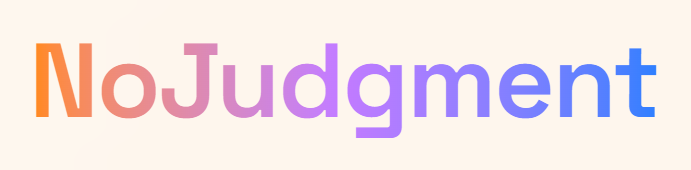
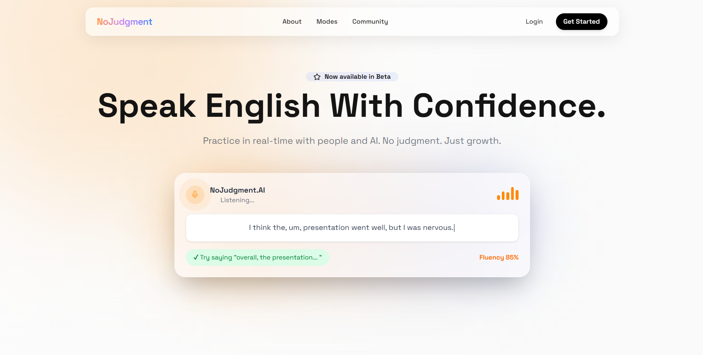
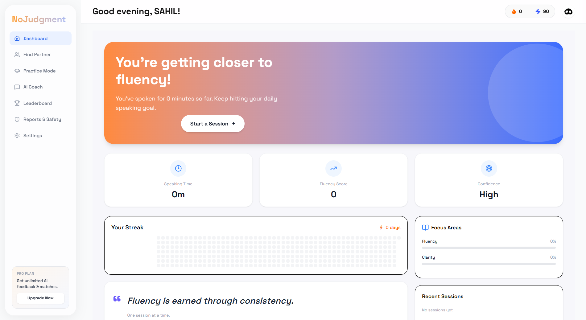

# NoJudgment — AI-Powered English Speaking Platform

<p align="center">
  
</p>

<p align="center">


</p>

<p align="center">
  Practice spoken English with real people and AI — without fear of judgment.
</p>

---

#  Overview

**NoJudgment** is an AI-powered English speaking practice platform designed for non-native speakers to improve communication confidence through real-time conversations, intelligent feedback, and performance analytics.

The platform combines:

-  Real-time peer matchmaking
-  WebRTC voice communication
-  AI-powered speech analysis
-  Progress tracking & analytics
-  Gamification systems
-  Safe moderated community

Unlike traditional learning apps, NoJudgment focuses on **real conversations** instead of passive exercises.

---

#  Core Features

## Real-Time Speaking Practice
- Connect with users based on skill level
- Live peer-to-peer voice conversations
- Topic-based matchmaking

## AI Speech Analysis
- Fluency scoring
- Clarity analysis
- Filler word detection
- English usage percentage
- Personalized AI feedback

## Analytics Dashboard
- Session performance tracking
- Daily progress heatmaps
- Weak area identification
- Session history & trends

## Gamification
- Points & streak system
- Global leaderboard
- Achievement badges
- Session rewards

## Moderation & Safety
- User reporting system
- Automatic moderation actions
- Safe and beginner-friendly environment

---

# 🖼 Screenshots

## Landing Page


## Matchmaking Dashboard


---

# Why NoJudgment?

Millions of people avoid practicing English because they fear embarrassment or judgment.

NoJudgment creates a safe environment where users can:
- speak freely,
- improve consistently,
- and receive constructive AI guidance.

The goal is simple:

> Help people gain confidence through real conversation.

---

# Tech Stack

## Frontend
- Next.js 16
- React 19
- TypeScript
- Tailwind CSS
- Framer Motion

## Backend
- Next.js API Routes
- Socket.io
- Prisma ORM
- NextAuth

## Database
- PostgreSQL

## AI & Realtime
- Groq SDK
- Llama 3.1
- WebRTC
- Socket.io Signaling

---

# System Architecture

```text
User
  ↓
Next.js Frontend
  ↓
Socket.io Matchmaking
  ↓
WebRTC Peer Connection
  ↓
AI Analysis Engine
  ↓
PostgreSQL Database
````

---

# Major Modules

| Module         | Description                  |
| -------------- | ---------------------------- |
| Authentication | Google OAuth login system    |
| Matchmaking    | Real-time peer matching      |
| Voice Rooms    | WebRTC audio communication   |
| AI Coach       | Conversational AI assistance |
| Analytics      | User performance tracking    |
| Leaderboard    | Gamification & rankings      |
| Moderation     | Reports & safety management  |

---

# 🛠 Installation

## Clone Repository

```bash
git clone https://github.com/yourusername/nojudgment.git
cd nojudgment
```

## Install Dependencies

```bash
npm install
```

## Setup Environment Variables

Create a `.env` file:

```env
DATABASE_URL=
NEXTAUTH_SECRET=
GOOGLE_CLIENT_ID=
GOOGLE_CLIENT_SECRET=
GROQ_API_KEY=
```

## Run Database Migration

```bash
npx prisma migrate dev
```

## Start Development Server

```bash
npm run dev
```

## Start Socket Server

```bash
npm run socket
```

Open:

```text
http://localhost:3000
```

---

# 📂 Project Structure

```bash
app/
components/
lib/
prisma/
public/
server.js
```

---

# Security & Performance

* Secure Google OAuth authentication
* HTTP-only JWT sessions
* Prisma parameterized queries
* WebRTC peer-to-peer communication
* Optimized serverless APIs
* Real-time Socket.io architecture

---

# 🌐 Deployment

| Service          | Usage                 |
| ---------------- | --------------------- |
| Vercel           | Frontend Hosting      |
| PostgreSQL       | Database              |
| Railway / Render | Socket Server Hosting |

---

# Roadmap

* Video calling support
* Mobile application
* AI pronunciation correction
* Group conversation rooms
* Voice emotion analysis
* AI interview practice mode

---

# Demo

```text
Live Demo: https://no-judgement.vercel.app/
```

---

# Future Vision

NoJudgment aims to become a globally accessible communication platform where language learners can practice naturally, confidently, and without fear.

---

# 📄 License

This project is licensed under the MIT License.

---

<p align="center">
  Made with ❤️ to help people speak English with confidence by Arpita, Sahil and Swoasti
</p>
```
